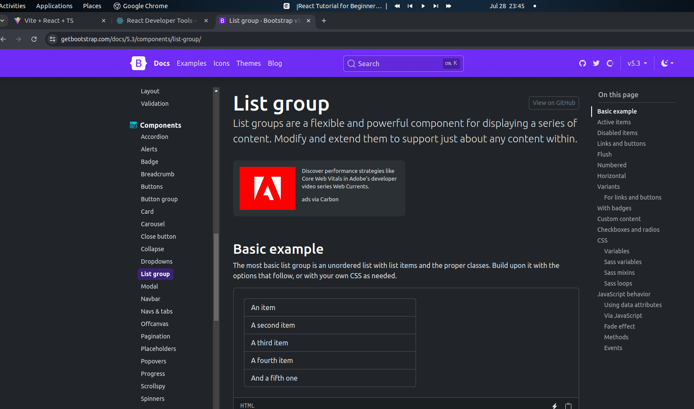
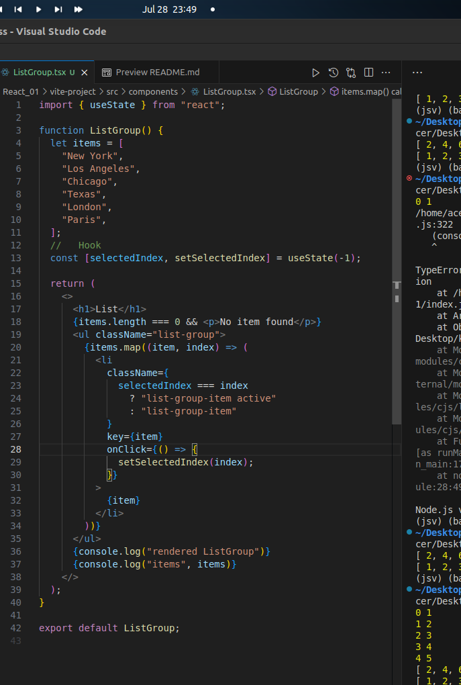
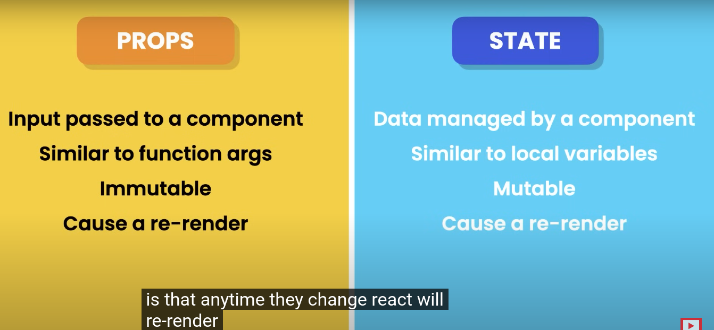

<!-- Read me of the project -->
centre the heading and bold the text
<h1 align="center" >React</h1>


## Why React?


```bash
React is a JavaScript library for building user interfaces. It is maintained by Facebook and a community of individual developers and companies. React can be used as a base in the development of single-page or mobile applications.
Build Faster Apps and User Interfaces , Scalable and Easy to Maintain, Reusable Components, SEO Friendly, Easy to Learn, Strong Community Support, Performance, and Testing.
```
### Bootstrap



### States and Onclick



### State vs Props





